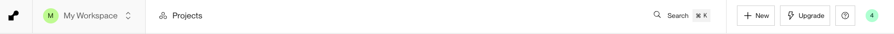
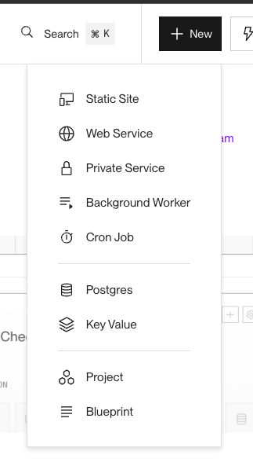
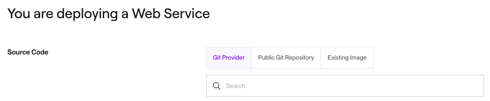
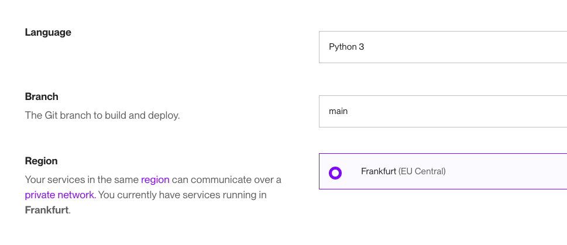
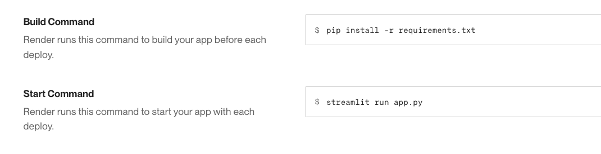

# Loan Default Predictor

[Loan Default Predictor](https://loan-default-predictor-0ouz.onrender.com) is a machine learning project that aims to predict whether a loan applicant is likely to default. Using a dataset of financial and demographic features, the model can predict the probability of defaulting. The project involves data preprocessing, feature selection, model training, and evaluation. It’s built using Python with tools like Pandas, Scikit-learn, and Matplotlib. The goal is to support more informed lending decisions with a simple, explainable prediction interface.

## Table of Content

+ [User Stories](#user-stories)
+ [Dataset Content](#dataset-content)
+ [Business Requirements](#business-requirements)
+ [Hypothesis](#hypothesis)
+ [Map of Business Requirements to Data Analytics Tasks](#map-of-business-requirements-to-data-analytics-tasks)
+ [ML Business Case](#ml-business-case)
+ [Dashboard Design](#dashboard-design)
+ [Technologies Used](#technologies-used)
+ [Deployment](#deployment)
+ [Testing](#testing)
+ [Credits](#credits)

## User Stories

## Dataset Content

The dataset, sourced from [Kaggle](https://www.kaggle.com/datasets/yasserh/loan-default-dataset), includes approximately 149,000 loan cases across 34 columns. Each row represents an individual loan and contains detailed information such as borrower demographics, loan characteristics, and payment details.

| Attribute      | Information          | Unit         |
|----------------|----------------------|--------------|
| ID | Client's loan application ID | Unique numerical identifier |
| year | Year of the application | 2019 |
| loan_limit | Whether the loan meets specific standards | conforming (cf) or non-conforming (ncf) |
| Gender | Gender of the applicant | male, female, joint, sex not available |
| approv_in_adv | Whether the loan is pre-approved | pre, nopre |
| loan_type | Type of the loan | type1, type2, type3 |
| loan_purpose | Purpose of the loan | p1, p2, p3, p4 |
| Credit_Worthiness | How likely is to the loan to be repaid | l1, l2 |
| open_credit | Indicates if the applicant has any open credit accounts | opc, nopc |
| business_or_commercial | Indicates if the loan if for business or personal purposes | business (ob/c) or personal (nob/c)
| loan_amount | The amount of money being borrowed | Numerical value |
| rate_of_interest | Interest rate on the loan | Numerical value |
| Interest_rate_spread | The difference between the loan's interest rate and a benchmark rate | Numerical value |
| Upfront_charges | Initial charges/down payment | Numerical value |
| term | Duration of the loan in months | Numerical value |
| Neg_ammortization | Indicates if the loan allows negative ammortization or not | neg_amm or not_neg |
| interest_only | Indicates if the loan has a interest-only payment | int_only or not_int |
| lump_sum_payment | Indicates whether a lump sum payment is due at the end of the loan term | lpsm or not_lpsm |
| property_value | The value of the property | Numerical value |
| construction_type | The type of the construction | site build (sb) or manufactured home (mh) |
| occupancy_type | The type of occupancy | primary residence (pr), secondary residence (sr) or investment property (ir) | 
| Secured_by | Indicates the type of asset used as collateral for the loan | home or land |
| total_units | Number of units being financed | 1U, 2U, 3U, 4U |
| income | Applicant's annual income | Numerical value |
| credit_type | Applicant's credit information source | Credit Information Bureau (CIB), CRIF Credit Information Bureau (CRIF), Experian (EXP) or Equifax (EQUI) |
| Credit_Score | Applicant's credit score | Numerical value |
| co-applicant_credit_type | Co-applicant's credit information | Credit Information Bureau (CIB) or Experian (EXP) |
| age | Applicant's age | <25, 25-34, 35-44, 45-54, 55-64, 65-74 and >74 |
| submission_of_application | Indicates the method through which the application was submitted | To institution (to_isnt) or not to institution (not_inst) |
| LTV | Loan-to-value ratio | Numerical value |
| Region | Geographic region of the property | North, south, central, North-East |
| Security_Type | Type of collateral backing the loan | direct ot indirect |
| Status | If the loan was defaulted (1) or not (0) | Numerical value |
| dtir1 | Debt-to-income ratio | Numerical value |

## Business Requirements

+ Banks generate significant revenue through loan lending, but it often comes with the risk of borrower defaults. To address this, banks have turned to Machine Learning. By analyzing historical data on past borrowers, they aim to develop a reliable ML model that can predict whether new borrowers are likely to default on their loans.
+ Business Requiremet 1: The client is interested in understanding the key factors that contribute to a loan default. 
+ Business Requirement 2: The client is interested in implementing a predictive model capable of determining the likelihood of a customer defaulting on a loan.

## Hypothesis

+ **Hypothesis 1**:
    + It is believed that key factors such as the interest rate, income, loan-to-value ratio, debt-to-income ratio, and credit score are critical in predicting whether a loan applicant is likely to default.

+ **Validation**: A correlation analysis was conducted, but it did not reveal any strong relationships between the variables and the default status. Consequently, feature selection was carried out using a pipeline with a tree-based model. The key features identified for the model were upfront charges, interest rate spread, rate of interest, credit type, and debt-to-income ratio. This process confirmed that some of the initial assumptions were correct, but not all.

+ **Hypothesis 2**:
    + Applicants who apply for loans through online or automated systems may have a higher likelihood of defaulting, as these methods could attract borrowers who may not be able to assess the loan’s long-term impact.
+ **Validation**: The analysis did not show any significant impact of the submission type on the likelihood of defaulting.

## Map of Business Requirements to Data Analytics Tasks

The goal of this project is to predict loan default risk, which is a crucial aspect for banks and lending institutions in managing financial risk. The business requirement is to accurately classify whether a loan applicant is likely to default or not. To achieve this, we first mapped the business requirement to the following data visualizations and machine learning tasks:

+ Business Requirement 1:
    + We analyzed the data to understand the relationship between various features and the likelihood of loan default.
    + We conducted a correlation study using Pearson and Spearman methods to explore potential relationships between the features and the target variable (default status).
    + The results of the correlation study did not reveal any strong relationships, so we moved on to fitting a machine learning model.
    + Feature importance was then used to identify the key factors influencing loan default predictions.

+ Business Requirement 2:
    + The goal was to build a binary classifier to predict whether a loan applicant would default or not.
    + We ran a custom function to identify the best model for predicting loan defaults and selected the Extra Trees Classifier, as it accounted for more features and performed well with our dataset.
    + Hyperparameters were left at their default values, as the model's performance was already exceptional, with cross-validation and the confusion matrix returning a recall and F1-score of 0.999.
    + Finally, the model can be used to predict if an applicant will likely to default or not.

## ML Business Case
### Predict Loan Status

#### Classification Model
+ We aimed to develop a machine learning model to predict whether a loan applicant is likely to default based on historical data from borrowers. The target variable is binary, where 0 indicates no default and 1 indicates default. We focused on creating a classification model, a supervised, 2-class model, which outputs either 0 (no default) or 1 (default).
+ The ideal outcome for the model is to accurately predict loan defaults, providing valuable insights to banks and financial institutions to help minimize the risk of defaults. We set performance goals of achieving at least 85% recall and 80% F1-score on both the training and testing datasets. These metrics are essential for ensuring that defaults are detected effectively without unnecessary false positives.
+ The model performed exceptionally well, exceeding the initial goals with both recall and F1-scores much higher than expected on both the train and test sets.

## Dashboard Design

### Page 1: Quick project summary
+ Project Terms & Jargon.
+ Description of Project Dataset.
+ State Business Requirements.

### Page 2: Loan Status Study
+ Presentation and exploration of data.
+ Visualization of feature importance with a detailed plot to highlight the most influential factors, as per requirement 1.
+ Presentation of the project hypothesis and validation.

### Page 3: Loan Status Prediction
+ Prediction of default likelihood based on inputed data, as per requirement 2.
+ Probability score display, to indicate the model's confidence in the prediction for that specific application.

### Page 4: ML Pipeline for Loan Status Prediction
+ Overview of key model performance metrics.
+ Description of the machine learning pipeline.
+ Visualization of the confusion matrix and cross-validation results.

## Technologies Used

### Language
+[Python](https://www.python.org/) is the main language for the project.

#### Python Packages
+ [Pandas](https://pandas.pydata.org/docs/index.html#) – For handling and analyzing structured data.
+ [Numpy](https://numpy.org/doc/stable/index.html#) – Provides support for numerical operations and arrays.
+ [YData Profiling](https://docs.profiling.ydata.ai/latest/) – Generates automated EDA reports.
+ [Matplotlib](https://matplotlib.org/) – For creating static visualizations.
+ [Seaborn](https://seaborn.pydata.org/) – Simplifies statistical data visualization.
+ [Feature Engine](https://feature-engine.trainindata.com/en/latest/) – Helps with feature engineering for ML.
+ [Scikit-learn](https://scikit-learn.org/stable/) – Tools for machine learning and model evaluation.
+ [Joblib](https://joblib.readthedocs.io/en/stable/) – For saving and loading models efficiently.

### Deployment and Version Control
+ [Git](https://git-scm.com/) manages version control.
+ [GitHub](https://github.com/) hosts the project.
+ [Render](https://render.com/) handles deployment.

### Other
+ [Streamlit](https://streamlit.io/) builds and displays the study.

## Deployment

+ To deploy both locally and to an external app, you must first:
    + Clone the repository from GitHub page by running the command `git clone https://github.com/mariaciceri/loan_default_predictor.git`;
    + Alternatively, download it as a ZIP file from the [GitHub page](https://github.com/mariaciceri/loan_default_predictor) and extract it to a chosen location in your computer;
    + To install the necessary libraries, run `pip install -r requirements.txt`.
        * `YData-profiling` dependency was preventing the page to be deployed, so it must installed separately via the terminal using `pip install ydata-profiling`.
    + Save the project on your own GitHub account by using the command `git push`.
    + Make sure to follow these steps before continuing with one of the deployment methods below.

### Deployment to Render
+ Log in to Render and click on the button New on the top-right corner.

+ Select `Web Service` from the dropdown menu.

+ Choose `Git Provider` and authorize Render to connect to your GitHub account if necessary.
+ Search for the project and select it.

+ Select a name for the project, and check if the other information like Language (Python 3), Branch (main), Region (your region) is set correctly, otherwise include them.

+ Include Build Command (pip install -r requirements.txt) and Start Command (streamlit run app.py)

+ Select the Instance Type of your choice and click on the Deploy Web Service button at the botton of the page.
+ It may take a couple of minutes to deploy, after completed, a link to the page will be available on the page, below the app's name.

### Run locally
+ On the terminal, navigate to the folder where the project is located in your computer and run `streamlit run app.py`.

## Testing

## Credits